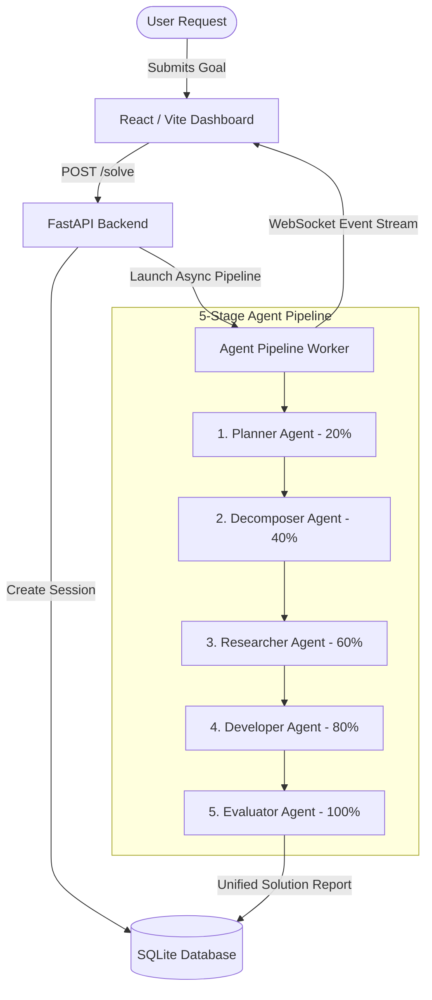

# AgentForge AI 🚀
### Autonomous Multi-Agent Orchestration Engine & Local Fine-Tuned Domain Models

[](https://opensource.org/licenses/Apache-2.0)
[](https://www.python.org/)
[](https://fastapi.tiangolo.com/)
[](https://react.dev/)
[](https://vitejs.dev/)
[](https://github.com/huggingface/peft)

**AgentForge AI** is a state-of-the-art multi-agent collaboration platform that decomposes complex engineering goals into structured, parallelized execution pipelines. It combines a high-performance **FastAPI** backend, a real-time **React + Tailwind CSS** frontend, and **5 specialized local fine-tuned LLM agents** (`Qwen/Qwen2.5-0.5B-Instruct` base).

---

## 🌟 Key Features

- 🤖 **Complete 5-Stage Multi-Agent Suite**:
  - **Planner Agent** (20%): Analyzes high-level goals and crafts a strategic execution roadmap.
  - **Decomposer Agent** (40%): Breaks goals into modular sub-tasks and assigns technical priorities.
  - **Researcher Agent** (60%): Gathers context, checks architectural constraints, and writes specs.
  - **Developer Agent** (80%): Generates production-ready code blocks (Python, JavaScript/React, SQL, Docker).
  - **Evaluator Agent** (100%): Reviews code quality, checks safety constraints, and synthesizes final solutions.
- ⚡ **Local LoRA Fine-Tuned Models**: Includes SFT fine-tuning scripts and pre-trained PEFT adapters (`fine_tuned_planner`, `fine_tuned_decomposer`, `fine_tuned_researcher`, `fine_tuned_developer`, `fine_tuned_evaluator`).
- 🦙 **100% Offline Ollama Integration**: Provides custom Ollama `Modelfile` definitions for local GPU execution without cloud API dependencies.
- 📡 **Real-Time WebSockets & Database**: Powered by SQLite via **SQLModel** with real-time status streaming over WebSockets.
- 📊 **Analytics & Reporting**: Built-in analytics stats (`GET /api/stats`), session management (`DELETE`), and report exports (`GET /api/session/{session_id}/export`).
- 🎨 **Modern Futuristic UI**: Built with React 19, Vite, Tailwind CSS, Framer Motion animations, and Lucide React icons.

---

## 🏗️ System Architecture



---

## 📂 Repository Structure

```
2026_SyntaxError/
├── backend/                  # FastAPI Backend Application
│   ├── app/
│   │   ├── database/        # Database setup & SQLModel schemas (db.py, models.py)
│   │   ├── routes/          # API route handlers (solve.py)
│   │   ├── schemas/         # Pydantic request/response schemas (schemas.py)
│   │   └── services/        # AI agent execution & WebSocket manager (ai_service.py)
│   ├── main.py              # Backend entrypoint
│   └── requirements.txt     # Python dependencies
├── fine_tuned_researcher/    # Fine-tuned LoRA PEFT adapter weights & model card for Researcher
├── fine_tuned_developer/     # Fine-tuned LoRA PEFT adapter weights for Developer Agent
├── fine_tuned_planner/       # Fine-tuned LoRA PEFT adapter weights for Planner Agent
├── fine_tuned_decomposer/    # Fine-tuned LoRA PEFT adapter weights for Decomposer Agent
├── fine_tuned_evaluator/     # Fine-tuned LoRA PEFT adapter weights for Evaluator Agent
├── Planner_Modelfile         # Ollama Modelfile for Planner Agent
├── Decomposer_Modelfile      # Ollama Modelfile for Decomposer Agent
├── Modelfile                 # Ollama Modelfile for Researcher Agent
├── Developer_Modelfile       # Ollama Modelfile for Developer Agent
├── Evaluator_Modelfile       # Ollama Modelfile for Evaluator Agent
├── planner_data.jsonl        # Dataset for Planner Agent
├── decomposer_data.jsonl     # Dataset for Decomposer Agent
├── research_data.jsonl       # Dataset for Researcher Agent
├── developer_data.jsonl      # Dataset for Developer Agent
├── evaluator_data.jsonl      # Dataset for Evaluator Agent
├── train_planner_agent.py    # Training script for Planner Agent
├── train_decomposer_agent.py # Training script for Decomposer Agent
├── train_research_agent.py   # Training script for Researcher Agent
├── train_developer_agent.py  # Training script for Developer Agent
├── train_evaluator_agent.py  # Training script for Evaluator Agent
├── train_all_agents.py       # Unified 5-agent trainer script
├── src/                      # Frontend Application (React + Vite)
│   ├── App.jsx              # Main AgentForge AI Dashboard UI
│   └── main.jsx             # React DOM root render
├── package.json              # Frontend npm dependencies
└── vite.config.js            # Vite configuration
```

---

## 🛠️ Quickstart & Setup Guide

### Prerequisites

- Python 3.10+
- Node.js 18+ and npm
- (Optional) Ollama for running local LLMs offline

---

### 1. Backend Setup

```bash
# Navigate to backend directory
cd backend

# Create and activate virtual environment
python -m venv .venv
# On Windows:
.venv\Scripts\activate
# On Linux/macOS:
source .venv/bin/activate

# Install requirements
pip install -r requirements.txt

# Run FastAPI dev server
python -m uvicorn app.main:app --reload --port 8000
```

The backend server will run at `http://127.0.0.1:8000`. Access Interactive API docs at `http://127.0.0.1:8000/docs`.

---

### 2. Frontend Setup

```bash
# In project root directory
npm install

# Start Vite dev server
npm run dev
```

Open `http://localhost:5173` in your browser to interact with the AgentForge AI dashboard.

---

## 🎯 Fine-Tuning All 5 Domain Models Locally

AgentForge AI includes scripts to fine-tune custom domain-specific agents using Hugging Face `transformers`, `peft` (LoRA), and `trl` (SFTTrainer) on top of `Qwen/Qwen2.5-0.5B-Instruct`.

### Run All Training Scripts
```bash
python train_planner_agent.py
python train_decomposer_agent.py
python train_research_agent.py
python train_developer_agent.py
python train_evaluator_agent.py
```

---

## 🦙 Ollama Local Offline Deployment

To run all 5 agents locally using Ollama:

```bash
ollama create planner-agent -f Planner_Modelfile
ollama create decomposer-agent -f Decomposer_Modelfile
ollama create researcher-agent -f Modelfile
ollama create developer-agent -f Developer_Modelfile
ollama create evaluator-agent -f Evaluator_Modelfile
```

---

## 📡 API Reference

| Endpoint | Method | Description |
| :--- | :--- | :--- |
| `GET /health` | `GET` | Backend health status. |
| `POST /solve` | `POST` | Start 5-stage multi-agent workflow for a given goal. |
| `GET /solve/{session_id}` | `GET` | Get current execution status and result for a session. |
| `GET /api/sessions` | `GET` | List recent 50 agent execution sessions. |
| `GET /api/stats` | `GET` | Get analytics dashboard statistics. |
| `DELETE /api/session/{session_id}` | `DELETE` | Delete session from database. |
| `GET /api/session/{session_id}/export` | `GET` | Export session markdown solution report. |
| `WS /ws/solve/{session_id}` | `WebSocket` | Stream real-time agent progress and events. |

---

## 🤝 Contributing & Team

Developed by **SyntaxError Team** (`2026_SyntaxError`):
- Repository: [https://github.com/TheSnowLord/2026_SyntaxError](https://github.com/TheSnowLord/2026_SyntaxError)

---

## 📄 License

This project is licensed under the Apache 2.0 License - see the [LICENSE](LICENSE) file for details.

