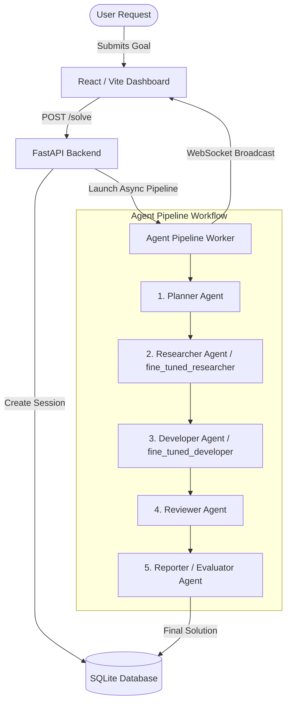

# AgentForge AI 🚀
### Autonomous Multi-Agent Orchestration Engine & Local Fine-Tuned Domain Models

[](https://opensource.org/licenses/Apache-2.0)
[](https://www.python.org/)
[](https://fastapi.tiangolo.com/)
[](https://react.dev/)
[](https://vitejs.dev/)
[](https://github.com/huggingface/peft)

**AgentForge AI** is a state-of-the-art multi-agent collaboration platform that decomposes complex engineering goals into structured, parallelized execution pipelines. It combines a high-performance **FastAPI** backend, a real-time **React + Tailwind CSS** frontend, and specialized **LoRA fine-tuned LLM agents** (`Qwen/Qwen2.5-0.5B-Instruct` base).

---

## 🌟 Key Features

- 🤖 **Multi-Agent Collaboration**: Orchestrates a pipeline of specialized agents:
  - **Planner Agent**: Analyzes high-level goals and crafts a strategic execution roadmap.
  - **Researcher / Decomposer Agent**: Gathers context, breaks goals into granular sub-tasks, and evaluates architectural constraints.
  - **Developer Agent**: Generates production-ready code blocks (Python, JavaScript/React, SQL, Docker).
  - **Reviewer / Evaluator Agent**: Validates code quality, safety, and performance constraints.
  - **Reporter Agent**: Synthesizes structured markdown summaries and final deliverables.
- ⚡ **Local LoRA Fine-Tuned Models**: Includes SFT fine-tuning scripts and pre-trained PEFT adapters (`fine_tuned_researcher`, `local_developer_model`).
- 🦙 **Ollama Model Integration**: Provides custom Ollama `Modelfile` definitions for local deployment.
- 📡 **Real-Time WebSockets & Database**: Powered by SQLite via **SQLModel** with real-time status streaming over WebSockets.
- 🎨 **Modern Futuristic UI**: Built with React 19, Vite, Tailwind CSS v4, Framer Motion animations, and Lucide React icons.

---

## 🏗️ System Architecture



---

## 📂 Repository Structure

```
2026_SyntaxError/
├── backend/                  # FastAPI Backend Application
│   ├── app/
│   │   ├── database/        # Database setup & SQLModel schemas (db.py, models.py)
│   │   ├── routes/          # API route handlers (solve.py)
│   │   ├── schemas/         # Pydantic request/response schemas (schemas.py)
│   │   └── services/        # AI agent execution & WebSocket manager (ai_service.py)
│   ├── main.py              # Backend entrypoint
│   └── requirements.txt     # Python dependencies
├── fine_tuned_researcher/    # Fine-tuned LoRA PEFT adapter weights & model card for Researcher
│   ├── adapter_config.json
│   ├── adapter_model.safetensors
│   ├── chat_template.jinja
│   ├── tokenizer.json
│   └── README.md            # Model Card
├── local_developer_model/    # Local checkpoints for fine-tuned Developer model
├── src/                      # Frontend Application (React + Vite)
│   ├── App.jsx              # Main AgentForge AI Dashboard UI
│   └── main.jsx             # React DOM root render
├── ai_agent_workflow/        # Workflow definitions & cached artifacts
├── Developer_Modelfile       # Ollama Modelfile for Developer Agent (qwen2.5:3b)
├── Modelfile                 # Ollama Modelfile for Researcher Agent (qwen2.5:3b)
├── developer_data.jsonl      # Supervised fine-tuning dataset for Developer Agent
├── research_data.jsonl       # Supervised fine-tuning dataset for Researcher Agent
├── train_developer_agent.py  # SFT fine-tuning script for Developer Agent
├── train_research_agent.py   # SFT fine-tuning script for Researcher Agent
├── index.html                # HTML entry point for Vite frontend
├── package.json              # Frontend npm dependencies
├── test_qwen.py              # Model generation test script
└── vite.config.js            # Vite configuration
```

---

## 🛠️ Quickstart & Setup Guide

### Prerequisites

- Python 3.10+
- Node.js 18+ and npm
- (Optional) Ollama for running local LLMs offline

---

### 1. Backend Setup

```bash
# Navigate to backend directory
cd backend

# Create and activate virtual environment
python -m venv .venv
# On Windows:
.venv\Scripts\activate
# On Linux/macOS:
source .venv/bin/activate

# Install requirements
pip install -r requirements.txt

# Create .env file with optional API keys (Gemini / Groq)
echo GEMINI_API_KEY=your_gemini_api_key > .env
echo GROQ_API_KEY=your_groq_api_key >> .env

# Run FastAPI dev server
python -m uvicorn app.main:app --reload --port 8000
```

The backend server will run at `http://127.0.0.1:8000`. Access Interactive API docs at `http://127.0.0.1:8000/docs`.

---

### 2. Frontend Setup

```bash
# In project root directory
npm install

# Start Vite dev server
npm run dev
```

Open `http://localhost:5173` in your browser to interact with the AgentForge AI dashboard.

---

## 🎯 Fine-Tuning Domain Models

AgentForge AI includes scripts to fine-tune custom domain-specific agents using Hugging Face `transformers`, `peft` (LoRA), and `trl` (SFTTrainer) on top of `Qwen/Qwen2.5-0.5B-Instruct`.

### Fine-Tuning Researcher Agent
```bash
python train_research_agent.py
```
This trains a LoRA adapter on `research_data.jsonl` and outputs weights to `./fine_tuned_researcher`.

### Fine-Tuning Developer Agent
```bash
python train_developer_agent.py
```
This trains a LoRA adapter on `developer_data.jsonl` and outputs weights to `./fine_tuned_developer`.

---

## 🦙 Ollama Local Deployment

To run agents locally using Ollama:

```bash
# Create Researcher model
ollama create researcher-agent -f Modelfile

# Create Developer model
ollama create developer-agent -f Developer_Modelfile

# Run Researcher Agent
ollama run researcher-agent "Analyze microservice requirements for FastAPI"
```

---

## 📡 API Reference

| Endpoint | Method | Description |
| :--- | :--- | :--- |
| `POST /solve` | `POST` | Start multi-agent workflow for a given goal. |
| `GET /solve/{session_id}` | `GET` | Get current execution status and result for a session. |
| `GET /api/sessions` | `GET` | List recent 50 agent execution sessions. |
| `WS /ws/solve/{session_id}` | `WebSocket` | Stream real-time agent progress and logs. |
| `GET /health` | `GET` | Backend health check. |

---

## 🤝 Contributing & Team

Developed by **SyntaxError Team** (`2026_SyntaxError`):
- Repository: [https://github.com/TheSnowLord/2026_SyntaxError](https://github.com/TheSnowLord/2026_SyntaxError)

---

## 📄 License

This project is licensed under the Apache 2.0 License - see the [LICENSE](LICENSE) file for details.
