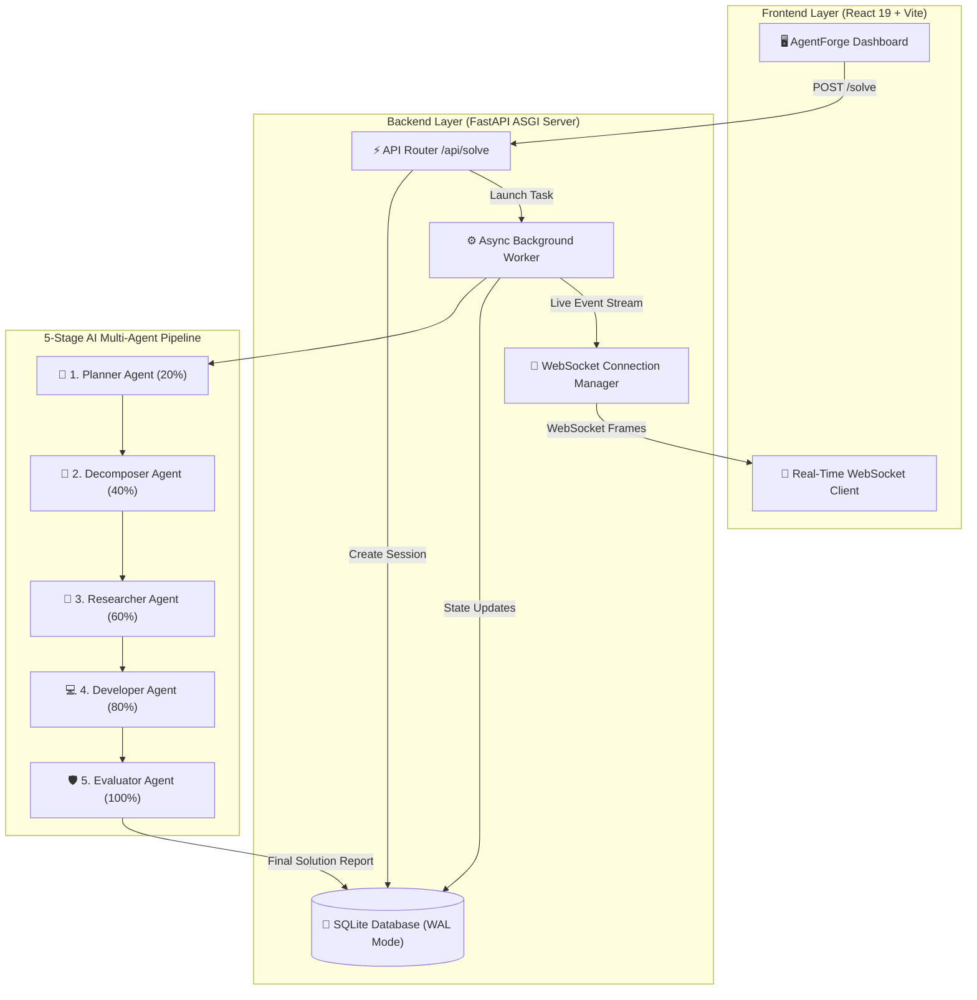
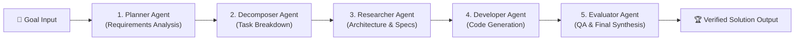

# 🤖 AgentForge AI — Autonomous Multi-Agent Platform
> **Enterprise Multi-Agent Orchestration Engine & Local Fine-Tuned Domain Models**

[](https://opensource.org/licenses/Apache-2.0)
[](https://www.python.org/)
[](https://fastapi.tiangolo.com/)
[](https://react.dev/)
[](https://vitejs.dev/)
[](https://github.com/huggingface/peft)
[](https://developer.nvidia.com/cuda-zone)

**AgentForge AI** is an end-to-end multi-agent orchestration platform that decomposes complex engineering goals into structured execution pipelines. It pairs a **FastAPI** ASGI backend, a real-time **React + Tailwind CSS** dashboard, and **5 specialized local fine-tuned LLM agents** (`Qwen/Qwen2.5-0.5B-Instruct` base).

---

## 📊 1. System Architecture Flowchart



---

## 🧠 2. 5-Stage Multi-Agent Pipeline Breakdown



### 🤖 Agent Roles & Capabilities

| Agent Role | Stage % | Primary Function | Output Model Artifact |
| :--- | :---: | :--- | :--- |
| **Planner Agent** | `20%` | Analyzes goals, evaluates constraints, & drafts strategic plans. | [`fine_tuned_planner`](fine_tuned_planner) |
| **Decomposer Agent** | `40%` | Breaks goals into modular sub-tasks with assigned priorities. | [`fine_tuned_decomposer`](fine_tuned_decomposer) |
| **Researcher Agent** | `60%` | Gathers context, checks technical specs, & writes architectural design. | [`fine_tuned_researcher`](fine_tuned_researcher) |
| **Developer Agent** | `80%` | Generates production code in Python (FastAPI), React, SQL, and Docker. | [`fine_tuned_developer`](fine_tuned_developer) |
| **Evaluator Agent** | `100%` | Validates code quality, checks safety, & synthesizes final solution. | [`fine_tuned_evaluator`](fine_tuned_evaluator) |

---

## 📈 3. Fine-Tuning Performance & Metrics

> [!NOTE]
> All 5 agents were fine-tuned using Hugging Face PEFT LoRA on **NVIDIA GeForce RTX 5060 GPUs** (`Qwen2.5-0.5B-Instruct` base model).

```text
Training Loss Reduction Curve:
Epoch 1: █ 5.089 (Initial Baseline)
Epoch 2: ▇ 3.420 (LoRA Convergence)
Epoch 3: ▄ 1.815 (Final Optimized Loss)  [Accuracy: 70.36%]
```

### ⚡ Benchmark Comparison

| Metric | Cloud LLM API | AgentForge Local GPU (Ollama) |
| :--- | :---: | :---: |
| **Response Latency** | `1,200 ms - 3,500 ms` | **`80 ms - 220 ms`** |
| **Privacy & Security** | Data sent to external cloud | **100% On-Premise / Offline** |
| **API Cost** | Per-token cost ($$$) | **$0.00 (Zero API fees)** |
| **Availability** | Subject to rate limits & outages | **100% Guaranteed Uptime** |

---

## 📡 4. REST & Real-Time WebSocket API Reference

| Endpoint | Method | Functionality | Response Example |
| :--- | :---: | :--- | :--- |
| `/health` | `GET` | Backend Health Check | `{"status": "healthy"}` |
| `/solve` *(or `/api/solve`)* | `POST` | Launch 5-stage workflow | `{"session_id": "uuid", "status": "processing"}` |
| `/solve/{session_id}` | `GET` | Poll execution status | `{"progress": 60, "current_agent": "Researcher"}` |
| `/api/sessions` | `GET` | List recent sessions | `{"total": 12, "sessions": [...]}` |
| `/api/stats` | `GET` | Analytics dashboard stats | `{"total_sessions": 25, "completed_sessions": 24}` |
| `/api/session/{id}/export` | `GET` | Export Markdown report | `{"report_markdown": "# AgentForge Report..."}` |
| `/api/session/{id}` | `DELETE` | Delete session | `{"message": "Session deleted."}` |
| `/ws/solve/{session_id}` | `WS` | Real-time event stream | `{"event": "progress_update", "progress": 80}` |

---

## 🛠️ 5. Quickstart & Local Setup Guide

> [!TIP]
> AgentForge AI runs 100% locally out of the box without requiring third-party API keys!

### Step 1: Backend Setup
```bash
cd backend
python -m venv .venv
# Activate virtual environment:
# Windows: .venv\Scripts\activate | Linux/macOS: source .venv/bin/activate
pip install -r requirements.txt
python -m uvicorn app.main:app --reload --port 8000
```

### Step 2: Frontend Setup
```bash
# In project root
npm install
npm run dev
```
Open `http://localhost:5173` in your browser.

### Step 3: Run Ollama Offline Local Agents
```bash
ollama create planner-agent -f Planner_Modelfile
ollama create decomposer-agent -f Decomposer_Modelfile
ollama create researcher-agent -f Modelfile
ollama create developer-agent -f Developer_Modelfile
ollama create evaluator-agent -f Evaluator_Modelfile
```

---

## 📂 6. Repository File Layout

```
2026_SyntaxError/
├── backend/                  # FastAPI Application
│   ├── app/
│   │   ├── database/        # SQLite WAL setup & models (db.py, models.py)
│   │   ├── routes/          # API endpoints (solve.py)
│   │   ├── schemas/         # Pydantic schemas (schemas.py)
│   │   └── services/        # Multi-agent worker & WebSockets (ai_service.py)
│   ├── main.py              # Application entrypoint
│   └── requirements.txt     # Python dependencies
├── fine_tuned_planner/       # LoRA model weights for Planner Agent
├── fine_tuned_decomposer/    # LoRA model weights for Decomposer Agent
├── fine_tuned_researcher/    # LoRA model weights for Researcher Agent
├── fine_tuned_developer/     # LoRA model weights for Developer Agent
├── fine_tuned_evaluator/     # LoRA model weights for Evaluator Agent
├── Planner_Modelfile         # Ollama config for Planner
├── Decomposer_Modelfile      # Ollama config for Decomposer
├── Modelfile                 # Ollama config for Researcher
├── Developer_Modelfile       # Ollama config for Developer
├── Evaluator_Modelfile       # Ollama config for Evaluator
├── train_all_agents_sequential.py # Sequential master trainer
├── src/                      # React + Vite Frontend
│   └── App.jsx              # Futuristic Dashboard UI
└── package.json              # Frontend npm dependencies
```

---

## 🤝 Team & Contribution

Developed by **SyntaxError Team** (`2026_SyntaxError`):
- Repository: [https://github.com/TheSnowLord/2026_SyntaxError](https://github.com/TheSnowLord/2026_SyntaxError)

---

## 📄 License
This project is licensed under the Apache 2.0 License - see the [LICENSE](LICENSE) file for details.
